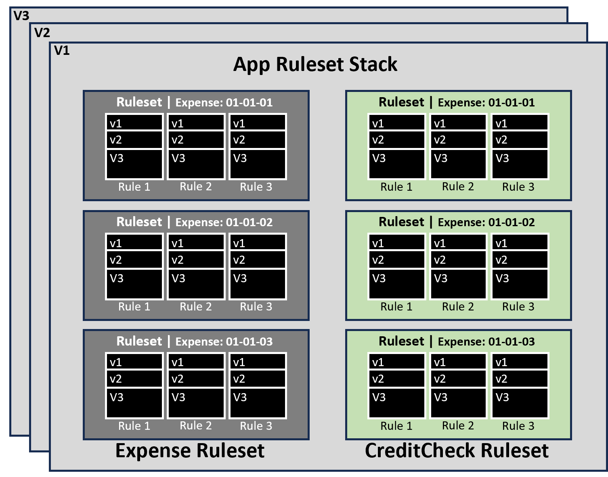

# Rules and Rule Types

---

- **Rule:**  
  A **Rule** is the fundamental building block of a **Pega Platform™** application. It defines the specific behavior or functionality of the application, such as decision logic, data processing, user interfaces, or integrations.

- **Rule Type:**  
  Each Rule belongs to a **Rule Type**, which determines the kind of behavior the Rule models. Examples include **Flow**, **Data Transform**, **Activity**, and **Section**. The Rule Type provides the structure and purpose for how the Rule operates within the application.

## Automated Rule creation in App Studio
- when configuring a **Case Type** in App Studio, you use the **Case Life Cycle** and **Configuration** panels to add Processes, define Steps, and configure Views.  
- Behind the scenes, Pega Platform automatically **creates and manages the Rules** that define the process flows, tasks, and user interface elements.

## Benefits of modularity with Rules:
 - **Versioning:** Pega Platform maintains a history of changes to a Rule, allowing developers to review the change history and undo changes if needed.
 - **Delegation:** Developers delegate Rules to business users to allow business users to update Case behavior as business conditions change
 - **Reuse:** Developers reuse Rules whenever an application needs to incorporate existing Case behavior

---

# Rulesets:
  A group of rules is called **Ruleset**. A Ruleset identifies, stores, and manages the set of Rules that define an application or a significant portion of an application.  

## Ruleset versioning:
  - Developers collect individual Rules into an instance of a Ruleset, called **a Ruleset version.**  
  - The Pega Ruleset semantic versioning follows the format **Major-Minor-Patch.**

### Ruleset Naming Guidelines

- **Do not use reserved prefixes:**  
  Avoid using `Pega` or `Pega-` at the beginning of Ruleset names. These prefixes are reserved for internal platform use and can cause unexpected behavior.

- **Avoid spaces:**  
  Ruleset names should not contain spaces.

- **Maximum length:**  
  A Ruleset name can be up to **32 characters** long.

- **Avoid special characters:**  
  Do not use dashes (`-`), underscores (`_`), plus signs (`+`), quotes (`" "`), or other special characters in Ruleset names, as they are not permitted.

---

# Ruleset stack:
  - Each application consists of a sequence of Rulesets called **a Ruleset stack.**
  - The Ruleset stack determines the order in which Pega Platform looks through Rulesets to find the Rule that is in use.
  - Each entry in the Ruleset stack represents all the versions of the specified Ruleset, starting with the listed version and working down to the lowest minor and patch version for the specified major version.